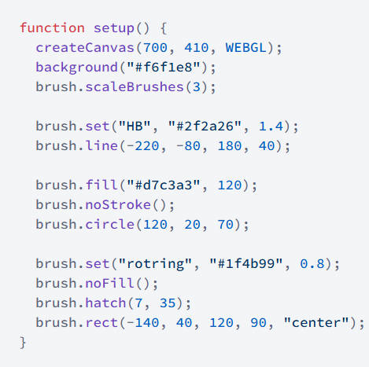
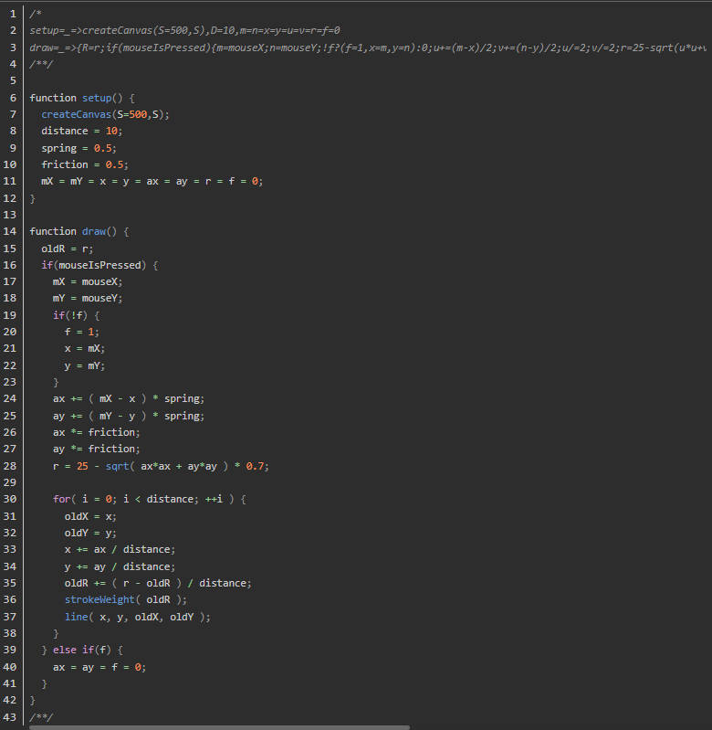
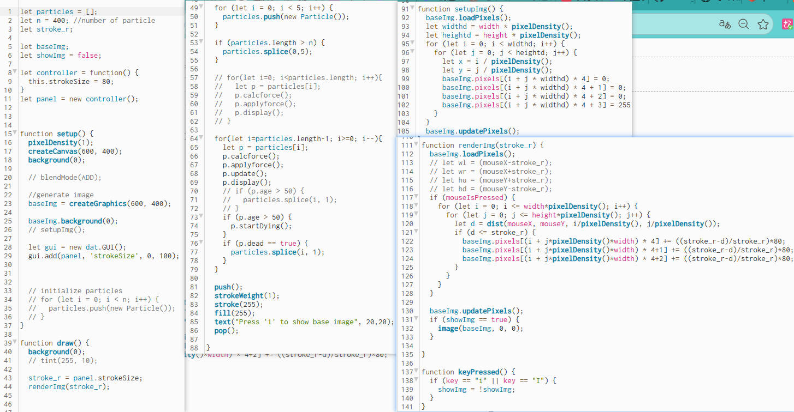
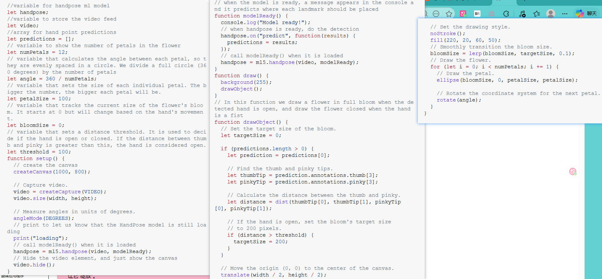

# yuli0835_9103_tut7
9103 creative coding
# Week 8 Quiz – Interactive Ink Painting with Motion

## Part 1: Imaging Technique Inspiration

### Chosen Technique: Spray Ink / Watercolor Brush + Motion Activation

The two reference projects from Rednote inspire a workflow where
the user paints with natural ink / watercolor brushes on a touch
screen and then triggers a dynamic motion effect on the finished
painting – for example, flowers and grass swaying as if blown by
wind – using a sensor or a gesture.

### What I want to incorporate

 **Spray‑paint / ink‑wash brushes** that react to stroke speed and
  pressure, producing organic, bleeding edges and variable opacity,
  similar to real brushwork.
 **Motion activation:** after the painting is complete, the drawn
  elements are animated through a **flow‑field or particle system**,
  so the flowers, leaves and ink strokes appear to dance and ripple.

> Below are two screenshots and links that illustrate the style I want to
> replicate.

[Link Text](63 【文字唤画，气息生风，让画中花草轻舞～ - maker馨丸 | 小红书 - 你的生活兴趣社区】 😆 sw5ky8fDBXcsPOu 😆 https://www.xiaohongshu.com/discovery/item/68d65900000000001302a5d6?source=webshare&xhsshare=pc_web&xsec_token=ABb6GrDRB2PLbGj2sJJ8y7zQiPamLLV35WrG8vfouJQf0=&xsec_source=pc_share)

[Link Text](64 【🎨交互｜涂鸦体验设计，用手机做涂鸦 - 新青年设计研究室 | 小红书 - 你的生活兴趣社区】 😆 6pkaARZYe3SljVm 😆 https://www.xiaohongshu.com/discovery/item/6880e0fe000000001203efb7?source=webshare&xhsshare=pc_web&xsec_token=ABIpJv4ociG1DkxaxMG-LwhxM70aWkAw9PWAfYB0IlZQo=&xsec_source=pc_share)

---

## Part 2: Coding Technique Exploration

### 1. Natural Ink / Watercolor Brushes – p5.brush.js

**What it does:**  
`p5.brush.js` is a p5.js library that adds real‑world drawing tools
(pencils, markers, watercolor fills, hatch patterns, and vector
fields) to creative‑coding sketches. It can simulate the soft,
bleeding edges and speed‑dependent stroke width typical of ink
brushes, and it includes a **Flow Field Generator** that bends
strokes organically – ideal for the “wind‑blown” look.

**How it helps:**  
- Provides ready‑to‑use `brush.field()` and `brush.line()` functions
  for dynamic stroke behaviour.
- The built‑in **Watercolor** fill gives the painting a traditional
  Chinese‑ink wash feeling.
- Works entirely in the browser with p5.js, so no special hardware is
  required for the brush part.

**Links to existing code & demo:**  
- Library: [p5.brush on jsDelivr](https://www.jsdelivr.com/package/npm/p5.brush)  
- Working example: [p5.brush teaser on p5.js Web Editor](https://editor.p5js.org/acamposuribe/sketches/bkb_CyJyi)  
- Tutorial: [Interactive Generative Art with p5.js, Tweakpane, and Watercolor Effects](https://alexcodesart.com/building-an-interactive-generative-art-with-p5-js-tweakpane-and-watercolor-effects/)

**Screenshot of the coding technique:**

---

### 2. Speed‑Based Chinese Ink Brush – Flow‑Rate Stroke Example

**What it does:**  
A code snippet from the Processing / p5.js brush collection uses a
spring‑friction model to create a **calligraphy brush** that becomes
thicker when the mouse moves faster, and produces an ink‑bleed effect
when moving slowly – perfect for writing or traditional flower‑and‑bird
painting.

**How it helps:**  
- Directly implements the “faster = thicker, slower = blot” ink‑brush
  behaviour that is essential for a convincing Chinese‑painting feel.
- The code is short and easy to embed in a larger interactive canvas.

**Links to existing code & demo:**  
- Code collection: [CSDN Brush Collection (includes flow‑rate ink brush)](https://blog.csdn.net/qq_46106285/article/details/136080806)  
- The specific “晕染” (ink‑bleed) brush is listed as **笔触5** in the article.

**Screenshot of the coding technique:**

---

### 3. Making the Painting Move – Flow Field + Particle System

**What it does:**  
Multiple open‑source p5.js projects use **Perlin‑noise flow fields**
combined with particle systems to animate static strokes. After the
user finishes painting, the drawn pixels can be sampled and used as
“centres” for hundreds of tiny particles that swirl and flow, creating
the illusion that the flowers and leaves are dancing.

**How it helps:**  
- The technique is well documented (tutorials + editable p5.js sketches
  available online).
- It can be triggered by a **mouse click, a key press, or a webcam
  gesture** (see the next technique).
- The visual result closely matches the “flowers swaying in the wind”
  effect seen in the Xiaohongshu references.

**Links to existing code & demo:**  
- “Flowing Starry Night” p5.js sketch: [Xiaozao Midterm Project](https://decodingnature.nyuadim.com/2023/10/17/xiaozao-midterm-project-flowing-painting/)  
- Minimal particle‑flow‑field example: [p5js-particle-flowfield repo](https://github.com/achjaderleon/p5js-pixel-flowfield) (see the `demo.gif` in the readme)

**Screenshot of the coding technique:**

---

### 4. Triggering Animation with Hand Gestures – ml5.js HandPose

**What it does:**  
The `ml5.js` library provides a browser‑based **HandPose** model that
tracks 21 keypoints of a hand using just a webcam. It can detect
gestures such as an **open palm, a fist, or a pinch**, and sends the
data to a p5.js sketch in real time.

**How it helps:**  
- Replaces an external sensor with a standard webcam – the user can
  “blow” or wave at the camera to activate the flow‑field animation.
- The official p5.js tutorial includes a complete interactive‑painting
  example that mixes hand tracking with drawing, providing a clear
  starting point for our gesture‑controlled motion.

**Links to existing code & demo:**  
- Tutorial: [Abracadabra: Speak With Your Hands in p5.js and ml5.js](https://p5js.org/es/tutorials/speak-with-your-hands/)  
- Example sketch (hand‑pose drawing): [Week 12 Final Project Draft – NYUAD](https://intro.nyuadim.com/2024/11/25/week-12-final-project-draft/)  
- The Coding Train video: [Hand Pose Detection & Interactive Painting with ML5.js (16 min)](https://www.classcentral.com/report/ml5-js-handpose-painting/)

**Screenshot of the coding technique:**

---

## References

| # | Resource | URL |
|---|----------|-----|
| 1 | p5.brush library | https://www.jsdelivr.com/package/npm/p5.brush |
| 2 | p5.brush teaser sketch | https://editor.p5js.org/acamposuribe/sketches/bkb_CyJyi |
| 3 | Watercolor effect tutorial | https://alexcodesart.com/building-an-interactive-generative-art-with-p5-js-tweakpane-and-watercolor-effects/ |
| 4 | CSDN brush code collection (ink‑bleed) | https://blog.csdn.net/qq_46106285/article/details/136080806 |
| 5 | Flowing Starry Night – p5.js flow field | https://decodingnature.nyuadim.com/2023/10/17/xiaozao-midterm-project-flowing-painting/ |
| 6 | Simple flow‑field particle demo (GitHub) | https://github.com/achjaderleon/p5js-pixel-flowfield |
| 7 | ml5.js HandPose tutorial | https://p5js.org/es/tutorials/speak-with-your-hands/ |
| 8 | Hand‑pose drawing project | https://intro.nyuadim.com/2024/11/25/week-12-final-project-draft/ |
| 9 | The Coding Train HandPose video | https://www.classcentral.com/report/ml5-js-handpose-painting/ |

